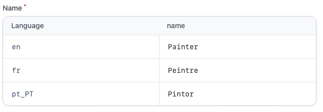

# Filament Inline Translate Field

[](https://packagist.org/packages/lucasgiovanny/filament-inline-translate-field)
[](https://packagist.org/packages/lucasgiovanny/filament-inline-translate-field)

Create a beautiful key-value field to allow users to enter all possible language values for a field on the same page



## Installation

1. You can install the package via composer:

```bash
composer require lucasgiovanny/filament-inline-translate-field
```

2. Configure you model, as defined on [spatie/laravel-translatable](https://spatie.be/docs/laravel-translatable/v6/installation-setup#content-making-a-model-translatable) documentation:

- Add the `Spatie\Translatable\HasTranslations` trait to the model that is going to use this field.
- Next, you should create a **public property** `$translatable` which holds an array with all the names of attributes you wish to make translatable.
- Finally, you should _make sure that all translatable attributes are set to the json-datatype in your database_. If your database doesn't support json-columns, use text.

```php
use Illuminate\Database\Eloquent\Model;
use Spatie\Translatable\HasTranslations;

class Activity extends Model
{
    use HasTranslations;

    public $translatable = ['name'];
}
```

3. Publish the configuration file to set the available languages:

```bash
php artisan vendor:publish --tag="filament-inline-translate-field-config"
```
```php
return [
    'available_locales' => [
        'en' => 'English',
        'fr' => 'French',
        'es' => 'Spanish',
    ],
];
```

Optionally, you can publish the translation files:

```bash
php artisan vendor:publish --tag="filament-inline-translate-field-translations
```
## Usage

```php
use LucasGiovanny\FilamentInlineTranslateField\Forms\Components\Fields\InlineTranslateField;

return $form
    ->schema([
        InlineTranslateField::make('name'),
    ]);
```

## Changelog

Please see [CHANGELOG](CHANGELOG.md) for more information on what has changed recently.

## Contributing

Please see [CONTRIBUTING](.github/CONTRIBUTING.md) for details.

## Security Vulnerabilities

Please review [our security policy](../../security/policy) on how to report security vulnerabilities.

## Credits

- [Lucas Giovanny](https://github.com/lucasgiovanny)
- [All Contributors](../../contributors)

## License

The MIT License (MIT). Please see [License File](LICENSE.md) for more information.
